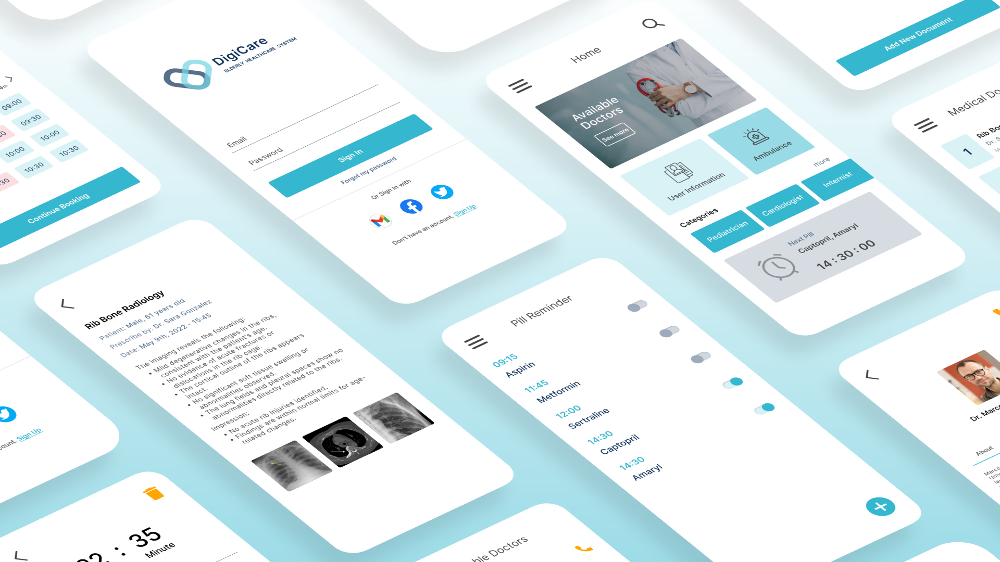

# 🩺 DigiCare – Healthcare Application

**A Human-Computer Interaction (HCI) case study and mobile healthcare solution designed to empower patients, caregivers, and seniors.**

🔗 [**View Full Case Study**](https://golnooshasady.framer.website/project/digicare)

---

## 📱 Overview

DigiCare is a Flutter-based mobile healthcare application focused on improving the quality of life for **elderly users and patients** by enabling them to:

- Manage **medical history**
- Schedule and manage **doctor appointments**
- Receive **pill reminders**
- Quickly **call for an ambulance**

It was developed as part of the **HCI Master's Course** at Sapienza University under the supervision of Professors **Tiziana Catarci** and **Valeria Mirabella**.

---

## 🎯 Key Features

- 📋 **Medical History Manager**: Upload, edit, and delete personal health records  
- 🗓 **Online Appointments**: Find doctors, read reviews, and schedule/reschedule appointments  
- 💊 **Pill Reminder**: Set custom alarms for medications, including dose and description  
- 📞 **Emergency Call**: Direct ambulance call from the home page for urgent care  
- 👤 **User Profile**: View and edit personal information  
- 🧭 **Accessible Navigation**: Intuitive side menu for quick access to all features  

---

## 🧠 HCI Methods Used

- ✅ **Requirement Analysis**: Through user questionnaires and competitive benchmarking  
- 📊 **Task Analysis**: HTA and STN diagrams to map user goals and interface transitions  
- 🧪 **Expert-Based Evaluation**: 
  - *Cognitive Walkthrough*
  - *Heuristic Evaluation* (based on Nielsen's principles)  
- 🧍‍♀️ **User-Centered Evaluation**:  
  - *Think-Aloud Protocol*
  - *Controlled Experiment* using ANOVA to compare interface performance  

---

## 🔧 Technologies

- **Programming Language**: Dart  
- **Framework**: Flutter  
- **IDE**: Android Studio Emulator  
- **Platform**: Android  
- **Libraries**: Flutter-specific packages for UI, navigation, state management  

---

## 🧪 Controlled Experiment Example

We tested two different interfaces for the ambulance feature placement:

- 📍 **Version A**: Ambulance access via menu  
- 🆘 **Version B**: Ambulance button directly on the homepage  

📈 Result: Version B significantly reduced response time in emergencies, confirmed by one-way ANOVA test.

---

## 📸 Screenshots

<p align="center">
  
</p>

> _Screenshots reflect latest prototype after expert and user feedback._

---

## 🚀 Future Work

- 🚕 Add integrated transportation (e.g., taxi booking)  
- 👨‍⚕️ Expand the doctor database by specialization  
- 📬 Send regular health tips via notifications or SMS  

---

## 📄 References

- [Case Study (Framer)](https://golnooshasady.framer.website/project/digicare)  
- [Questionnaire](https://docs.google.com/forms/d/1YZwpNOiRwFQzKiYiVeLsAr0YSU8Qcjr9OmuqNMyngY4/)  
- [Heuristic Evaluation - Nielsen](https://en.wikipedia.org/wiki/Heuristic_evaluation#Nielsen's_heuristics)

---

## 📥 Installation (For Development)

```bash
git clone https://github.com/golnooshA/digiCare.git
cd digicare
flutter pub get
flutter run
